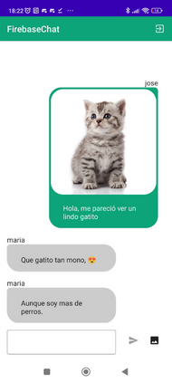
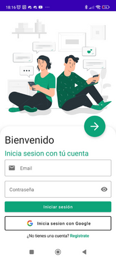
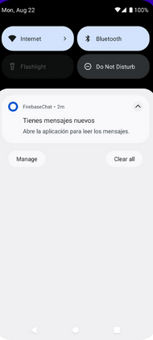

# FirebaseChat

Este mes de agosto me he animado a resolver el reto de MoureDev, para crear una aplicación de chat 
utilizando como backend Firebase. El desarrollo está realizado en Android con Jetpack Compose.

Puedes probar la aplicación descargando el [APK](https://github.com/jalucenyo/FirebaseChat/releases/download/v0.1-beta.0/firebasechat-beta.apk)

Para el envío de notificaciones he desarrollado una pequeña *Function* de Firebase, que se encarga
de enviar una notificación a un *Topic*, cada vez que se envía un mensaje. En el siguiente
repositorio [https://github.com/jalucenyo/FirebaseChatBack](https://github.com/jalucenyo/FirebaseChatBack)
tienes el código de la función

Estoy empezando con Jetpack Compose, si no me equivoco con los conceptos e intentado seguir un
patrón MVVM (Model View ViewModel), todos los *Composables* incluso las pantallas son sin estado 
ni lógica. La lógica y estado se encuentran en el ViewModel de cada *pantalla*, teniendo una 
única fuente de la verdad y un canal unidireccional de eventos y estado.

Hay muchos puntos de mejora por hacer como:

- [ ] Cambiar de foco entre los text fields
- [ ] Acciones en el teclado
- [ ] Mejorar las notificaciones con el texto del mensaje
- [ ] Añadir test de UI.

Y algunas cosas mas .. :-)

## En que consiste el reto (Agosto: 02/08/22):

**FIREBASE CHAT:** Crea una aplicación de chat usando Firebase como tu backend.

**NOTA:** Para la revisión en directo desde Twitch se agradece crear un readme con un enlace de descarga, url de la web desplegada o vídeo/capturas con la ejecución de la app. Gracias!

¿Nunca te has preguntado cómo funciona un chat? Pues bien, vamos a crear una aplicación que utilice varios de los servicios de Firebase para login y base de datos en tiempo real.

**¿En qué consiste el reto?**

*La aplicación tendrá una pantalla donde tendrás que hacer login con tu cuenta de Google.*

*Una vez realizado, accederás a una sala de chat donde se visualizarán los mensajes de todos los usuarios y podrás interactuar con ellos.*

*¡Punto extra! ¿Eres capaz de enviar notificaciones push a otro dispositivo cada vez que te escriben?¿E imágenes?*

#### Fecha de entrega estimada: 27/08/22
De esta manera podrás recibir feedback técnico sobre tu prueba y asistir a su revisión en directo desde Twitch el día de la publicación del próximo reto mensual.

#### ¿Te animas a resolver este desafío? Aquí tienes [todos los detalles](https://bit.ly/3vyk6ap).
